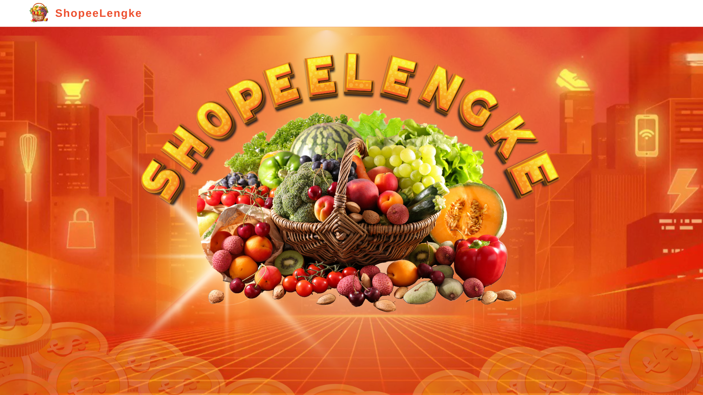
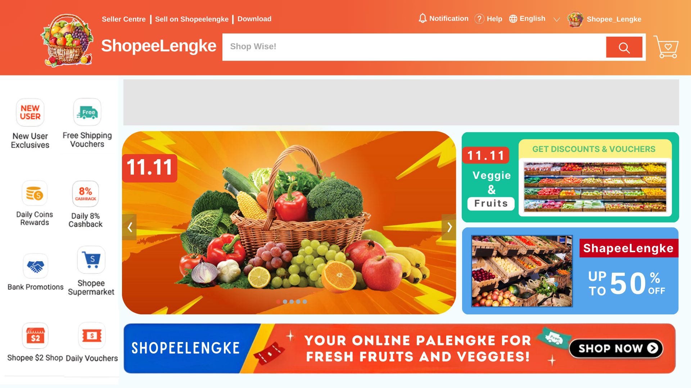

# Grocery-Management-System

## Shopeelengke
<strong>"Your Go-To App for Fresh Fruits and Veggies, Anytime, Anywhere!"</strong>

### Introduction
Shopeelengke is a virtual marketplace that blends the convenience of e-commerce with the familiarity of a traditional market. Its name combines "Shopee," a popular shopping app,and "palengke, " the Filipino word for market. The platform offers 10 types of vegetables, such as carrots and tomatoes, and 10 types of fruits, including apples and mangoes. Shopeelengke aims to provide an efficient grocery shopping experience while showcasing the practical application of Data Structures and Algorithms (DSA) in optimizing online transactions.

   

### Purpose
The project’s primary purpose is to address two main objectives:
<ul>
  <li>
    To create a simplified, efficient platform for buying fresh produce, catering to
users who prefer an organized online shopping experience for fruits and
vegetables.
  </li>
  <li>
    To serve as a practical demonstration of the role of data structures and
algorithms in real-world applications, emphasizing their importance in
system efficiency and problem-solving.
  </li>
</ul>

### Features
Shopeelengke incorporates several features designed to enhance user experience
and streamline shopping activities. These features include:

<ul>
  <li>
    Aesthetic user interface: A visually appealing and user-friendly design that
ensures smooth navigation.
  </li>
  
  <li>Login and registration system: Secure account management for
customers.
  </li>
  
  <li>
    Shopping options: Organized sections for vegetables and fruits, allowing
users to browse products efficiently.
  </li>
  
  <li>
    Shopping cart management: A dynamic system where users can add,
update, or remove items during their shopping session.
  </li>
  <li>
    Shopping history: A detailed log of previous transactions, enabling users to
view their past purchases.
  </li>
</ul>

<strong>In addition to these, Shopeelengke integrates essential backend functionalities
powered by SQL databases and DSA techniques, such as: </strong>
<ul>
  <li>Customer database: Stores user credentials, such as username and
password, using a linked-list structure.
  </li>
  <li>
    Shopping history database: Utilizes stacks to record order history, including
product names, prices, quantities, and transaction timestamps.
  </li>
  <li>
    Sorting and searching: Implements sorting techniques to organize products
by price or name, and searching algorithms to help users quickly locate
specific items.
  </li>
</ul>
